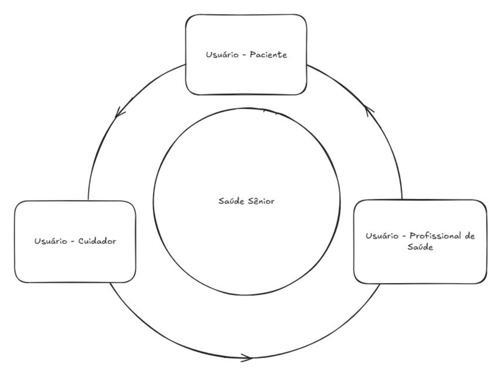

# PDS1 - Grupo 9
- Guilherme R. Kameoka  
- Carlos Livius  
- Esdras  
- Pedro Alexandre  
- Guilherme Rafael  
  
# Sobre
O sistema proposto busca resolver o problema da organização e monitoramento das necessidades dos idosos por meio de uma plataforma mobile intuitiva, conectando cuidadores, médicos e os próprios idosos.    

A solução computacional envolve um aplicativo que permite o registro e acompanhamento de atividades diárias, compartilhamento de informações de saúde e integração com dispositivos wearables, como relógios inteligentes, para captar dados biométricos em tempo real. 

Dessa forma, o aplicativo facilita a comunicação entre todos os envolvidos e melhora o acompanhamento da saúde dos idosos, promovendo um suporte mais eficiente e personalizado. 

# Ambiente de desenvolvimento

  

- **Front-end:** HTML5, TailwindCSS

- **Back-end:** Node.js para gerenciar a lógica do sistema e as APIs de integração. 

- **Banco de Dados:** PostgreSQL para armazenar dados estruturados. 

- **Armazenamento na Nuvem:** AWS para guardar arquivos como relatórios médicos e imagens. 

- **Integração com Wearables:** APIs como Google Fit, Apple HealthKit para comunicação com relógios inteligentes. 

- **Segurança e Conformidade:** Autenticação via Firebase Auth, criptografia de dados sensíveis e conformidade com a LGPD e GDPR. 

# Envolvidos 

  

- **Desenvolvedores:** Responsáveis pela implementação do sistema. 

- **Designers de UX/UI:** Focam em tornar a interface mais intuitiva e acessível. 

- **Equipe de Segurança e Conformidade:** Garantem que o sistema atenda às regulamentações de proteção de dados. 

- **Cuidadores  e Médicos:** Usuários finais que utilizarão o sistema para monitorar e cuidar dos idosos. 

- **Idosos:** Usuários finais que se beneficiarão diretamente do sistema. 